<h1 align="center">termaid</h1>

<p align="center">Render Mermaid diagrams in your terminal or Python app.</p>

<p align="center">
  
</p>

**[Try it online at termaid.com](https://termaid.com)**

## Features

- **18 diagram types:** flowcharts, sequence, class, ER, state, block, git, gantt, architecture, pie, treemap, mindmap, timeline, kanban, quadrant, XY chart, user journey, and packet
- **Zero dependencies:** pure Python, nothing to install beyond the package itself
- **Terminal-aware:** auto-fits diagrams to terminal width with progressive compaction
- **Rich and Textual integration:** colored output and TUI widgets with optional extras
- **6 color themes:** default, terra, neon, mono, amber, phosphor
- **ASCII fallback:** works on any terminal, even the most basic ones
- **Pipe-friendly CLI:** `cat diagram.mmd | termaid` just works

## Why?

Mermaid is great for documentation, but rendering it usually means spinning up a browser or calling an external service. termaid lets you render diagrams over SSH, in CI logs, inside TUI apps, or anywhere you have a Python environment. It was built because the existing tools in this space, like [mermaid-ascii](https://github.com/AlexanderGrooff/mermaid-ascii) (Go) and [beautiful-mermaid](https://github.com/lukilabs/beautiful-mermaid) (TypeScript), don't offer a native Python library you can import and call directly.

## Install it using your package manager:

### Pip

```bash
pip install termaid
```

### Homebrew

```bash
brew install termaid
```

Or try it without installing:

```bash
uvx termaid diagram.mmd
```

## Quick start

### CLI

```bash
termaid diagram.mmd
echo "graph LR; A-->B-->C" | termaid
termaid diagram.mmd --theme neon
termaid diagram.mmd --ascii
```

### Python

```python
from termaid import render

print(render("graph LR\n  A --> B --> C"))
```

```python
# Colored output (requires: pip install termaid[rich])
from termaid import render_rich
from rich import print as rprint

rprint(render_rich("graph LR\n  A --> B", theme="terra"))
```

```python
# Textual TUI widget (requires: pip install termaid[textual])
from termaid import MermaidWidget

widget = MermaidWidget("graph LR\n  A --> B")
```

## Supported diagram types

### Flowcharts

All directions supported: `LR`, `RL`, `TD`/`TB`, `BT`.

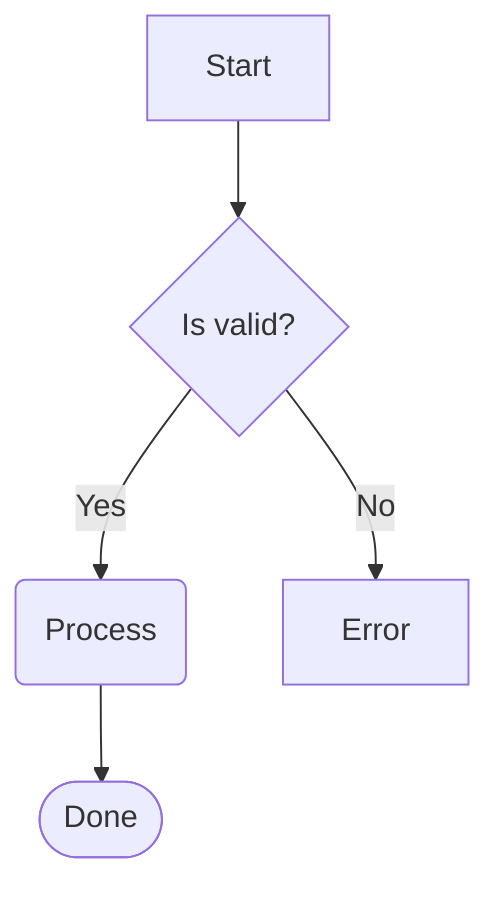

```
┌─────────────┐
│             │
│    Start    │
│             │
└──────┬──────┘
       │
       │
       ▼
┌──────◇──────┐
│             │
│  Is valid?  │
│             │
└──────◇──────┘
       │
       │
       ╰──────────────────╮
    Yes│                  │No
       ▼                  ▼
╭─────────────╮    ┌─────────────┐
│             │    │             │
│   Process   │    │    Error    │
│             │    │             │
╰──────┬──────╯    └─────────────┘
       │
       │
       ▼
╭─────────────╮
(             )
(    Done     )
(             )
╰─────────────╯
```

**Node shapes:** rectangle `[text]`, rounded `(text)`, diamond `{text}`, stadium `([text])`, subroutine `[[text]]`, circle `((text))`, double circle `(((text)))`, hexagon `{{text}}`, cylinder `[(text)]`, asymmetric `>text]`, parallelogram `[/text/]`, trapezoid `[/text\]`, and `@{shape}` syntax

**Edge styles:** solid `-->`, dotted `-.->`, thick `==>`, bidirectional `<-->`, circle endpoint `--o`, cross endpoint `--x`, labeled `-->|text|`, variable length `--->`, `---->`

**Styling:** `classDef`, `style`, `linkStyle` directives, `:::className` suffix

**Subgraphs:** nesting, cross-boundary edges, per-subgraph `direction` override

**Other:** `%%` comments, `;` line separators, Markdown labels `` "`**bold** *italic*`" ``, `&` operator (`A & B --> C`)

### Sequence diagrams

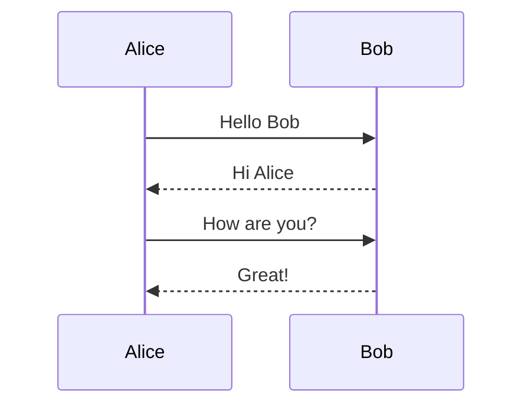

```
 ┌──────────┐      ┌──────────┐
 │  Alice   │      │   Bob    │
 └──────────┘      └──────────┘
       ┆ Hello Bob       ┆
       ──────────────────►
       ┆ Hi Alice        ┆
       ◄┄┄┄┄┄┄┄┄┄┄┄┄┄┄┄┄┄┄
       ┆ How are you?    ┆
       ──────────────────►
       ┆ Great!          ┆
       ◄┄┄┄┄┄┄┄┄┄┄┄┄┄┄┄┄┄┄
       ┆                 ┆
```

**Message types:** solid arrow `->>`, dashed arrow `-->>`, solid line `->`, dashed line `-->`

**Participants:** `participant`, `actor`, aliases

### Class diagrams

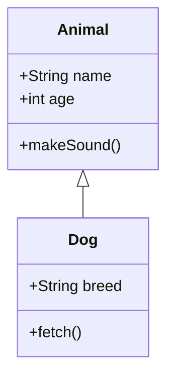

```
  ┌──────────────┐
  │    Animal    │
  ├──────────────┤
  │ +String name │
  │ +int age     │
  ├──────────────┤
  │ +makeSound() │
  └──────────────┘
          △
          │
          │
          │
  ┌───────────────┐
  │      Dog      │
  ├───────────────┤
  │ +String breed │
  ├───────────────┤
  │ +fetch()      │
  └───────────────┘
```

**Relationships:** inheritance `<|--`, composition `*--`, aggregation `o--`, association `--`, dependency `..>`, realization `..|>`

**Members:** attributes and methods with visibility (`+` public, `-` private, `#` protected, `~` package)

### ER diagrams

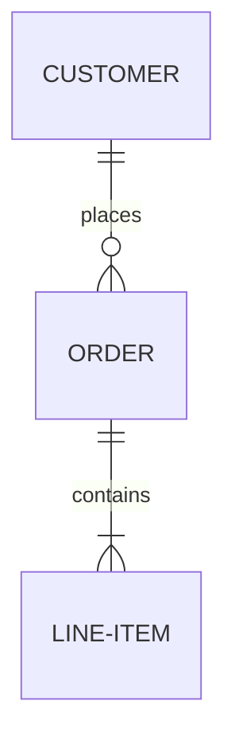

```
  ┌──────────────┐
  │   CUSTOMER   │
  └──────────────┘
          │1
          │ places
          │
          │0..*
  ┌──────────────┐
  │    ORDER     │
  └──────────────┘
          │1
          │ contains
          │
          │1..*
  ┌──────────────┐
  │  LINE-ITEM   │
  └──────────────┘
```

**Cardinality:** `||` (exactly one), `o|` (zero or one), `}|` (one or more), `o{` (zero or more)

**Line styles:** solid `--`, dashed `..`

**Attributes:** type, name, keys (`PK`, `FK`, `UK`), comments

### State diagrams

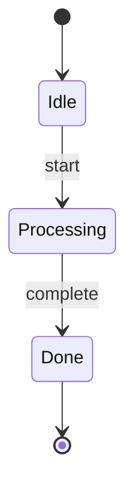

```
╭───────◯──────╮
│              │
│      ●       │
│              │
╰───────◯──────╯
        │
        │
        ▼
╭──────────────╮
│              │
│     Idle     │
│              │
╰───────┬──────╯
        │
   start│
        ▼
╭──────────────╮
│              │
│  Processing  │
│              │
╰───────┬──────╯
        │
complete│
        ▼
╭──────────────╮
│              │
│     Done     │
│              │
╰───────┬──────╯
        │
        │
        ▼
╭───────◯──────╮
│              │
│      ◉       │
│              │
╰───────◯──────╯
```

**Features:** `[*]` start/end states, transition labels, `state "name" as alias`, composite states (`state Parent { }`), stereotypes (`<<choice>>`, `<<fork>>`, `<<join>>`)

### Block diagrams

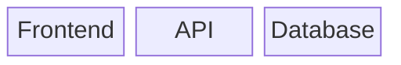

```
  ┌──────────┐    ┌──────────┐    ┌──────────┐
  │          │    │          │    │          │
  │ Frontend │    │   API    │    │ Database │
  │          │    │          │    │          │
  └──────────┘    └──────────┘    └──────────┘
```

**Features:** `columns N`, column spanning (`blockname:N`), links between blocks, nested blocks

### Git graphs

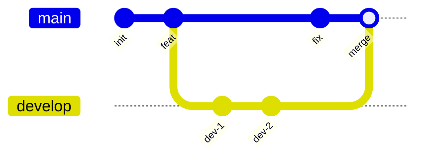

```
  main    ───●─────●──────┼──────────────●──────●─
           init  feat     │             fix   merge
                          │                     │
  develop                 ●───────●─────────────┼
                        dev-1   dev-2
```

**Directions:** `LR` (default), `TB`, `BT`

**Commands:** `commit` (with `id:`, `type:`, `tag:`), `branch` (with `order:`), `checkout`/`switch`, `merge`, `cherry-pick`

**Commit types:** `NORMAL` (●), `REVERSE` (✖), `HIGHLIGHT` (■)

**Config:** `%%{init: {"gitGraph": {"mainBranchName": "master"}}}%%`

### Pie charts

Yes, the syntax says `pie`. No, we don't draw a circle. I know. Have you ever tried to read a pie chart made of `█` and `▓`? Exactly. We render them as horizontal bar charts instead.

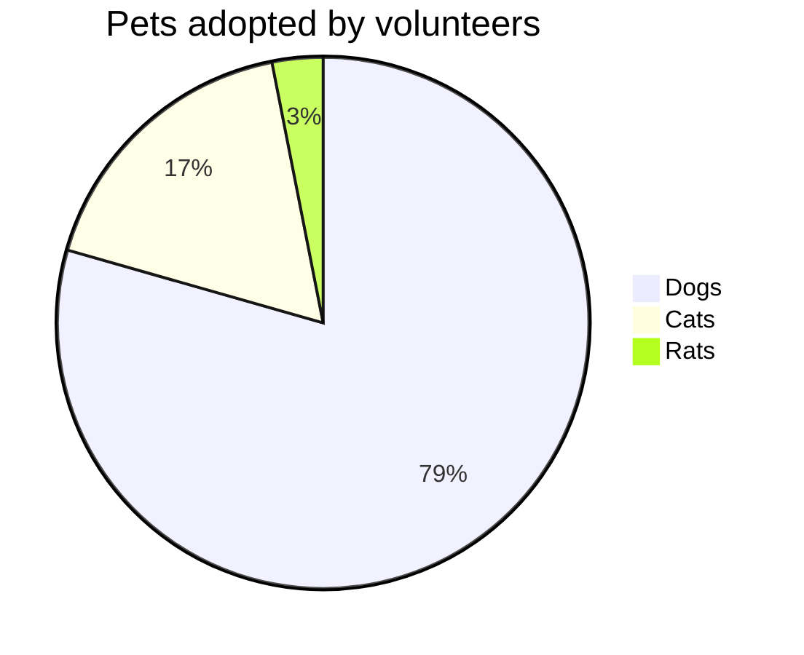

```
  Dogs┃████████████████████████████████  79.4%
  Cats┃▓▓▓▓▓▓▓  17.5%
  Rats┃░   3.1%
```

**Features:** `title`, `showData` (display raw values), `%%` comments

### Treemaps

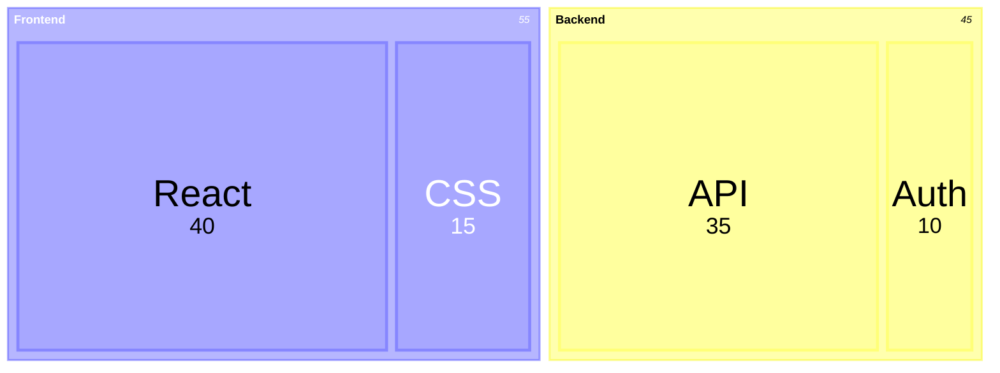

```
┌┄┄┄┄┄┄┄┄┄┄┄┄┄┄┄┄┄┄┄┄┄┄┄┄┄┄┄┄┄┄┄┄┄┄┄┐ ┌┄┄┄┄┄┄┄┄┄┄┄┄┄┄┄┄┄┄┄┄┄┄┄┄┄┄┄┄┐
┆             Frontend              ┆ ┆          Backend           ┆
┆┌───────────────────────┐ ┌───────┐┆ ┆┌───────────────────┐ ┌────┐┆
┆│         React         │ │  CSS  │┆ ┆│        API        │ │Auth│┆
┆│          40           │ │  15   │┆ ┆│        35         │ │ 10 │┆
┆│                       │ │       │┆ ┆│                   │ │    │┆
┆└───────────────────────┘ └───────┘┆ ┆└───────────────────┘ └────┘┆
└┄┄┄┄┄┄┄┄┄┄┄┄┄┄┄┄┄┄┄┄┄┄┄┄┄┄┄┄┄┄┄┄┄┄┄┘ └┄┄┄┄┄┄┄┄┄┄┄┄┄┄┄┄┄┄┄┄┄┄┄┄┄┄┄┄┘
```

**Features:** nested sections via indentation, `"label": value` syntax, proportional sizing, `%%` comments

### Mindmaps

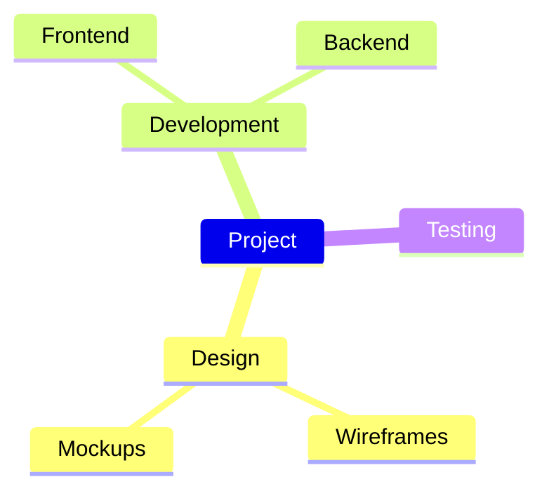

```
          ╭─ Design ──╭─ Wireframes
          │           ╰─ Mockups
Project ──├─ Development ──╭─ Frontend
          │                ╰─ Backend
          ╰─ Testing
```

**Features:** indentation-based nesting, automatic overflow to the left when many children, rounded/sharp/ASCII branch characters, Mermaid shape markers stripped (`(round)`, `[square]`, `{{hexagon}}`, `)cloud(`)

### XY Charts

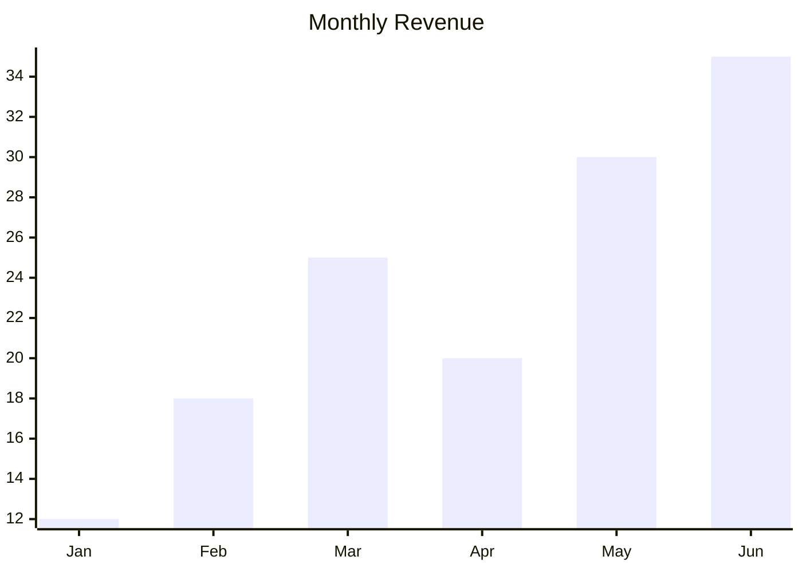

```
                 Monthly Revenue

     35 │                              ████
        │                              ████
        │                        ▄▄▄▄  ████
     28 │                        ████  ████
        │            ▄▄▄▄        ████  ████
        │            ████        ████  ████
     21 │            ████  ▄▄▄▄  ████  ████
        │      ▄▄▄▄  ████  ████  ████  ████
        │      ████  ████  ████  ████  ████
     14 │      ████  ████  ████  ████  ████
        │████  ████  ████  ████  ████  ████
        │████  ████  ████  ████  ████  ████
      7 │████  ████  ████  ████  ████  ████
        │████  ████  ████  ████  ████  ████
        │████  ████  ████  ████  ████  ████
      0 └──┬─────┬─────┬─────┬─────┬─────┬─
          Jan   Feb   Mar   Apr   May   Jun
```

**Features:** bar charts, line charts, bar+line combos, horizontal orientation (`xychart horizontal`), axis labels, `xychart` and `xychart-beta` keywords, rounded/sharp line corners, JSON ingest

### User Journeys

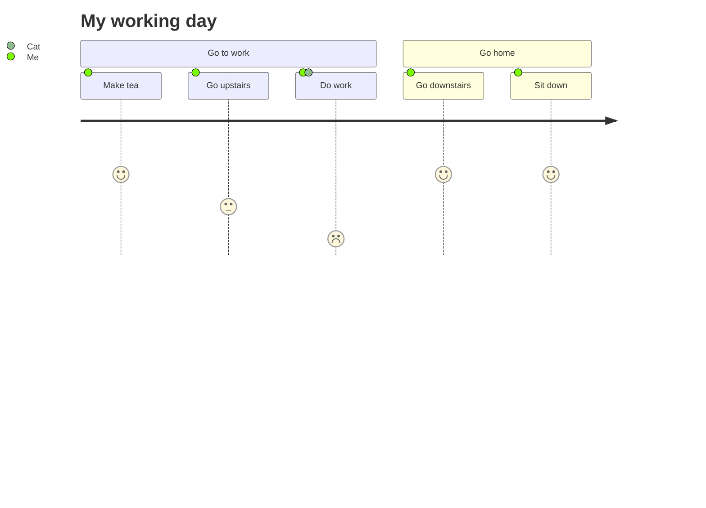

```
  My working day

  ● Cat
  ◆ Me

  ╭───────────── Go to work ──────────────╮   ╭───────── Go home ───────────╮

  ╭◆─────────╮ ╭◆────────────╮ ╭●◆───────╮    ╭◆──────────────╮ ╭◆─────────╮
 ─│ Make tea │─│ Go upstairs │─│ Do work │────│ Go downstairs │─│ Sit down │────►
  ╰──────────╯ ╰─────────────╯ ╰─────────╯    ╰───────────────╯ ╰──────────╯
       😄            😐            😞                😄              😄
```

**Features:** sections, satisfaction scores (😞-😄), multi-actor support with distinct symbols (●◆■▲), rounded/sharp/ASCII corners

### Packet Diagrams

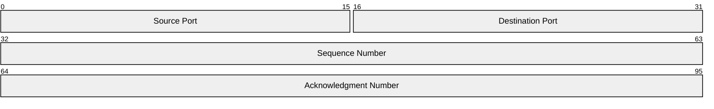

```
 0                                             15 16                                           31
 ╭───────────────────────────────────────────────┬───────────────────────────────────────────────╮
 │                 Source Port                   │               Destination Port                │
 ╰───────────────────────────────────────────────┴───────────────────────────────────────────────╯
 32                                                                                            63
 ╭───────────────────────────────────────────────────────────────────────────────────────────────╮
 │                                       Sequence Number                                         │
 ╰───────────────────────────────────────────────────────────────────────────────────────────────╯
 64                                                                                            95
 ╭───────────────────────────────────────────────────────────────────────────────────────────────╮
 │                                    Acknowledgment Number                                      │
 ╰───────────────────────────────────────────────────────────────────────────────────────────────╯
```

**Features:** bit-aligned field layouts, boundary numbers, auto-increment (`+N`) syntax, separated boxes per row, truncated label legend with bit ranges, `packet` and `packet-beta` keywords

## CLI options

| Flag | Description |
|------|-------------|
| `--ascii` | ASCII-only output (no Unicode box-drawing) |
| `--theme NAME` | Color theme (requires `pip install termaid[rich]`). Use `--themes` to list |
| `--themes` | List all available color themes |
| `--demo [TYPE]` | Render sample diagrams (`all`, `flowchart`, `sequence`, `mindmap`, etc.) |
| `--padding-x N` | Horizontal padding inside boxes (default: 4) |
| `--padding-y N` | Vertical padding inside boxes (default: 2) |
| `--gap N` | Space between nodes (default: 4). Use `1` or `2` for compact diagrams |
| `--inline-edge-labels` | Attach flowchart labels directly to their edges |
| `--width N` | Max output width. Re-renders with smaller gap/padding if exceeded |
| `--no-auto-fit` | Disable automatic compaction when diagram exceeds terminal width |
| `--sharp-edges` | Sharp corners on edge turns instead of rounded |
| `-o FILE` | Write output to file instead of stdout |
| `--show-ids` | Show node IDs alongside labels for debugging (e.g. `myId: My Label`) |
| `--json TYPE` | Pipe JSON/tabular data and render as `treemap`, `pie`, `mindmap`, `flowchart`, or `xychart` |
| `--tui` | Interactive TUI viewer (requires `pip install termaid[tui]`) |

## Python API

### `render(source, ...) -> str`

Render a Mermaid diagram as a plain text string. Auto-detects diagram type.

### `render_rich(source, ..., theme="default") -> rich.text.Text`

Render as a [Rich](https://rich.readthedocs.io/) `Text` object with colors. Requires `pip install termaid[rich]`.

### `MermaidWidget`

A [Textual](https://textual.textualize.io/) widget with a reactive `source` attribute. Requires `pip install termaid[textual]`. Updates live when you change the `source` property.

```python
from termaid import MermaidWidget

class MyApp(App):
    def compose(self):
        yield MermaidWidget("graph LR\n  A --> B")
```

## Themes

11 built-in themes for `--theme` / `render_rich()`. Run `termaid --themes` to list them.

**Text themes** (foreground colors only):

| Theme | Colors | Description |
|-------|--------|-------------|
| `default` |    | Cyan nodes, yellow arrows, white labels |
| `terra` |    | Warm earth tones (browns, oranges) |
| `neon` |    | Magenta nodes, green arrows, cyan edges |
| `mono` |    | White/gray monochrome |
| `amber` |    | Amber/gold CRT-style |
| `phosphor` |    | Green phosphor terminal-style |

**Solid themes** (filled backgrounds with foreground colors):

| Theme | Colors | Description |
|-------|--------|-------------|
| `gruvbox` |    | Gruvbox dark palette |
| `monokai` |    | Monokai dark with pink/green accents |
| `dracula` |    | Dracula purple/pink/green palette |
| `nord` |    | Nord muted blue/cyan arctic palette |
| `solarized` |    | Solarized dark blue/yellow/cyan |

## Optional extras

```bash
pip install termaid[rich]      # Colored terminal output
pip install termaid[textual]   # Textual TUI widget
```

## Limitations

- **Layout engine is approximate.** Node positioning uses a grid-based barycenter heuristic. Very dense graphs may still produce some edge crossings.
- **Manhattan-only edge routing.** Edges use A* pathfinding on a grid. The engine auto-expands gaps for crossing edges and biases toward flow-aligned routes.
- **Wide diagrams.** The CLI auto-compacts when the diagram exceeds terminal width. For very wide LR chains, use `--width N`, `--gap 1`, or pipe through `less -S`.

## Gallery

See the [examples page](https://fasouto.github.io/termaid-web/examples.html) for rendered examples of all 18 supported diagram types.

## Acknowledgements

Inspired by [mermaid-ascii](https://github.com/AlexanderGrooff/mermaid-ascii) by Alexander Grooff and [beautiful-mermaid](https://github.com/lukilabs/beautiful-mermaid) by Lukilabs.

## License

MIT
